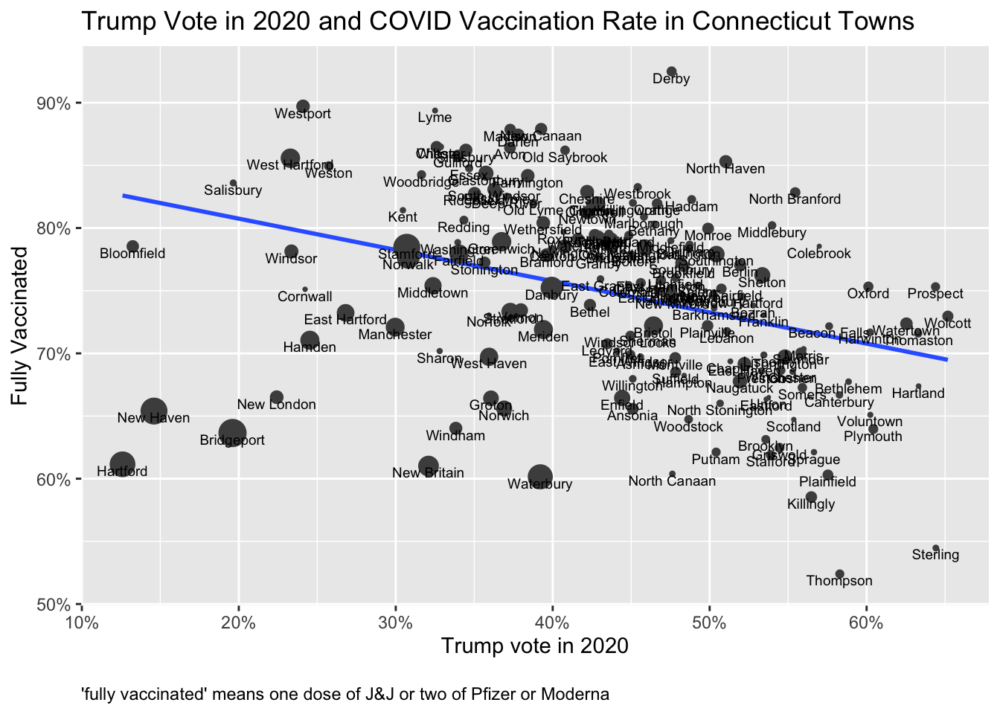
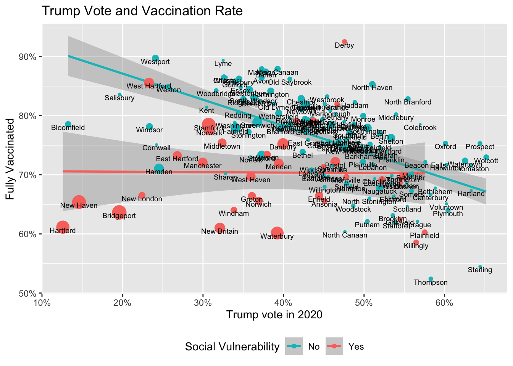
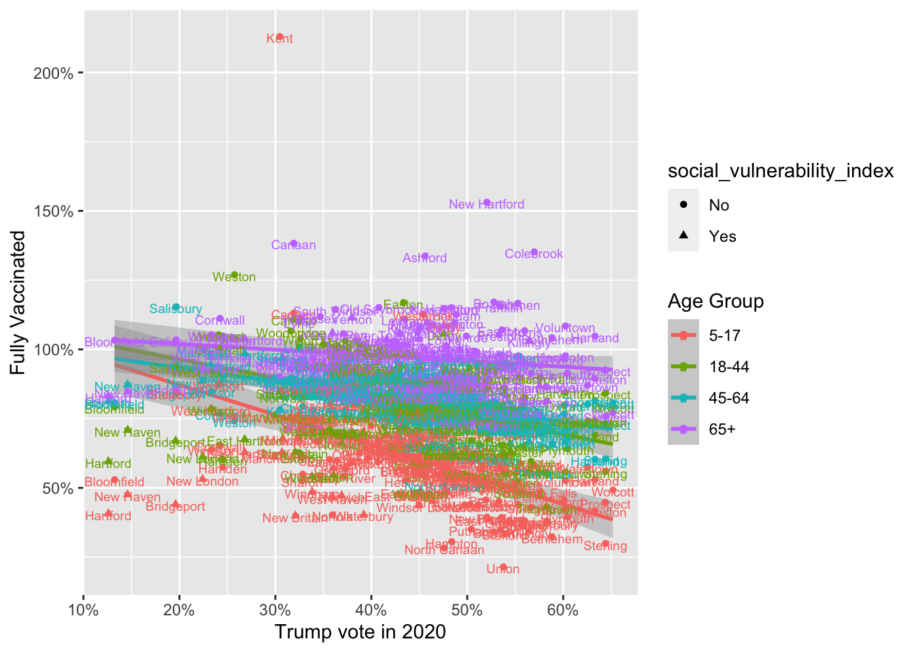

-   <a href="#trump-vote-and-covid-vaccination" id="toc-trump-vote-and-covid-vaccination">Trump Vote and COVID Vaccination</a>
-   <a href="#work-by-charles-gaba-on-trump-vote-and-covid-vaccination" id="toc-work-by-charles-gaba-on-trump-vote-and-covid-vaccination">Work by Charles Gaba on Trump Vote and COVID Vaccination</a>
-   <a href="#the-trump-vote-and-vaccination-rate-relationship-applies-less-well-in-poorer-towns" id="toc-the-trump-vote-and-vaccination-rate-relationship-applies-less-well-in-poorer-towns">The Trump Vote and Vaccination Rate Relationship Applies Less Well in Poorer Towns</a>
-   <a href="#polling-on-partisanship-and-vaccination" id="toc-polling-on-partisanship-and-vaccination">Polling on Partisanship and Vaccination</a>
-   <a href="#some-quick-reactions" id="toc-some-quick-reactions">Some Quick Reactions</a>
-   <a href="#the-issue-of-the-population-denominator-and-its-effects-on-vaccination-rates" id="toc-the-issue-of-the-population-denominator-and-its-effects-on-vaccination-rates">The Issue of the Population Denominator and Its Effects on Vaccination Rates</a>

### Trump Vote and COVID Vaccination

The plot below shows the relationship between COVID vaccination rates[^1] and the percentage of the vote for Trump in the 2020 election for each Connecticut town.

<figure>

</figure>

Figure 1: Trump Vote in 2020 and COVID Vaccination Rate

As the trend line emphasizes, a large vote percentage for Trump is associated with a lower percentage of individuals who are fully vaccinated.

### Work by Charles Gaba on Trump Vote and COVID Vaccination

The inspiration for this post is work that [Charles Gaba](https://t.co/x3Vu568chv?amp=1) has been doing showing the [relationship](https://acasignups.net/21/11/23/weekly%20to%20update%20to%20us%20to%20covid19%20to%20vaccination%20to%20levels%20to%20county%20to%20trump%20to%202020%20to%20vote)[between](https://acasignups.net/vaccinations "Vaccine info at Gaba website")[2020 vote and vaccinations](https://acasignups.net/21/11/23/weekly%20to%20update%20to%20us%20to%20covid19%20to%20vaccination%20to%20levels%20to%20county%20to%20trump%20to%202020%20to%20vote) and deaths using county to level data for all states. The next figure shows a summary of the relationship between Trump vote by county and vaccination rate for all counties in the US. The idea behind this post was to use Connecticut data to look at this relationship at a geographic unit smaller than a county.

{#fig-gaba-chart}

### The Trump Vote and Vaccination Rate Relationship Applies Less Well in Poorer Towns

Looking at the lower left portion of the first figure for Connecticut, we see that the biggest cities in Connecticut don't follow the national pattern. They have a very low vote rate for Trump but also tend to have below-average vaccination rates. Political affiliation has a role, but there are other important factors as well.

The CDC has constructed something they call the [social vulnerability index](https://www.atsdr.cdc.gov/placeandhealth/svi/fact_sheet/fact_sheet.html) to indicate communities that are more vulnerable to events that threaten public health. It is based on 15 characteristics from the Census Bureau which they group as socioeconomic factors, household composition, race/ethnicity/language, and housing/transportation.

In the next figure, the trend line is shown separately for towns flagged by the social vulnerability index (shown in a reddish color) in contrast with towns less "vulnerable" towns flagged in green. The "vulnerable" towns are mostly the large urban centers in Connecticut, which tend to include areas with high poverty, lower educational attainment, and other factors measured by the index. The Connecticut Department of Public Health has applied the social vulnerability index index to towns by flagging the whole town if only one census tract within the town is flagged as vulnerable. One can quibble with how well the index categorizes Connecticut towns. For example, West Hartford is coded as vulnerable while Hamden is coded as not vulnerable. The index is not perfect, but the general trend is clear: for towns flagged as vulnerable there is no relationship between Trump vote and vaccination rate, while the trend line for other towns shows a steeper negative slope. Note that the social vulnerability index predates the COVID pandemic. It was designed to be a sign of general public health vulnerability either in terms of disease or natural disasters.

The relationship between Trump vote and vaccination is interesting and remarkable, but it is important to remember that there are factors such as wealth and education that have a significant relationship to vaccination decisions separate from political preferences or ideology.

<figure>

</figure>

Figure 2: Considering Social Vulnerability of Town

Note that for the trend lines in the plot I have eliminated Mansfield and Simsbury as outliers. Manfield is the location of University of Connecticut. Some students may be counted in census population for Manfield, but getting their vaccinations elsewhere. I don't know what's going on with Salisbury

<figure>

</figure>

Figure 3: Separately by Age of Vaccinated

### Polling on Partisanship and Vaccination

The plot in Figure @ref(fig:1) and the analyses done by Charles Gaba individual vaccination behavior to aggregate entities. That can be tricky.

See this summary based on the the [Marquette University Law School Poll](https://law.marquette.edu/poll/).

<blockquote class="twitter-tweet">

Here is vaccination status by age and party, suggested by <a href="https://twitter.com/AFilindra?ref_src=twsrc%5Etfw">@AFilindra</a>   This pools Sept & Nov 2021 <a href="https://twitter.com/MULawPoll?ref_src=twsrc%5Etfw">@MULawPoll</a> national surveys to maximize cases. Estimates are logit fits by party.  Partisan gap narrows with age, but obvious partisan difference even among old. <a href="https://t.co/klA11TY5YX">pic.twitter.com/klA11TY5YX</a>

--- Charles Franklin (@PollsAndVotes) <a href="https://twitter.com/PollsAndVotes/status/1465126616561029126?ref_src=twsrc%5Etfw">November 29, 2021</a>
</blockquote>

In their [recent poll response](https://law.marquette.edu/poll/2021/09/23/new-marquette-law-school-poll-finds-strong-partisan-divisions-on-afghanistan-covid-policies-and-election-results/), Table 11: Vaccination status, by party identification, Sept. 2021

*Table 11: Vaccination status, by party identification, Sept. 2021*

| Party ID    | Vaccinated | Not Vaccinated |
|-------------|------------|----------------|
| Republican  | 64         | 35             |
| Independent | 74         | 25             |
| Democratic  | 90         | 9              |

### Some Quick Reactions

The first interesting thing is that the relationship between Trump vote and vaccination is so different for the over 65 crowd. It's only the under 65 population for whom a higher Trump vote is correlated with lower vaccination (and that relationship is probably even clear if one separate out the towns flagged with the social vulnerability index or the large cities).

I'll sleep on this and see what I think tomorrow.

#### Sources

Vote stats come from [The Secretary of State](https://ctemspublic.pcctg.net/#/reports).

Vaccination rates are from DPH via [data.ct.gov](https://data.ct.gov/Health%20to%20and%20to%20Human%20to%20Services/COVID%20to%2019%20to%20Vaccinations%20to%20by%20to%20Town%20to%20and%20to%20Age%20to%20Group/gngw%20to%20ukpw).

### The Issue of the Population Denominator and Its Effects on Vaccination Rates

The Department of Public Health (DPH) provides vaccination rates by age ranges by town. For this plot I have collapsed the age ranges into four groups. DPH also provides an estimated population for each range. Note that you see a lot of vaccination percentages above 100%. That's probably an issue with the estimated population. DPH includes their estimate of the population with all of their statistics. See \[this page\](<https://portal.ct.gov/dph/Health> to Information to Systems to to Reporting/Population/Population to Statistics for [this description of technical issues](https://authoring.ct.gov/%20to%20/media/Departments%20to%20and%20to%20Agencies/DPH/Population/PopulationStatisticsOverviewpdf.pdf). I am uncertain where that leaves things. It's possible they are using estimates based on the 2010 to 2014 surveys from Census. I am in my own town of Guilford the population is definitely aging. It became more of a bedroom community for New Haven in the 1970's and that original influx has benn growing old together. Something similar may be going on in other towns, and that might make the estimates of population for older ages come out too low. I'm not sure. (John Burn-Murdoch of the *Financial Times* has pointed that that one needs to watch out for [issues with the denominators](https://threadreaderapp.com/thread/1447617110910382081.html) while comparing vaccination rates.)

#### Vaccination Rate Depends Both on the Population Denominator and the Vax Doses

As near as I can tell (and I may be wrong), DPH is using the population figures from the Census ACS from 2010-2014 (a five year average). The most recent ACS data I could fetch was for 2015-2019. I used that data to estimate the population by age by town. The plot below compares the effect of using either the DPH population estimate or the latest ACS estimate as the denominator when calculating the vaccination rate. It makes a noticeable difference. The town names are show for cases where the difference in population estimates is greater than 5%.

    [1] "ACS 2010-2014"

    # A tibble: 0 × 3
    # … with 3 variables: age <fct>, estimate <chr>, pct <chr>

    [1] "ACS 2015-2019"

    # A tibble: 5 × 3
      age      estimate  pct   
      <fct>    <chr>     <chr> 
    1 Under 18 743,833   20.8% 
    2 18-44    1,214,627 34.0% 
    3 45-64    1,015,561 28.4% 
    4 65+      601,053   16.8% 
    5 Total    3,575,074 100.0%

    [1] "ACS 2016-2020"

    # A tibble: 7 × 3
      age          estimate  pct   
      <chr>        <chr>     <chr> 
    1 18-44        1,215,774 34.1% 
    2 45-64        1,003,725 28.1% 
    3 65+          615,466   17.2% 
    4 Total        3,570,549 100.0%
    5 Total Female 1,828,861 51.2% 
    6 Total Male   1,741,688 48.8% 
    7 Under 18     735,584   20.6% 

[^1]: Wherever I refer to vaccination rates in this post, I'm referring to "fully vaccinated" as originally interpreted by the CDC. In practical terms at least one booster dose is also needed, but the easiest way to assemble the data is to stick with the original "fully vaccinated" definition.
