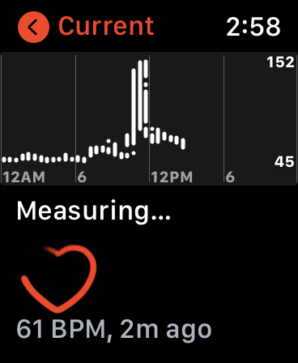

**A disclaimer: Not only am I not a cardiologist, but if you asked me to point
to the location of the heart in my chest, I wonder whether I would
point to the correct spot. Perhaps the information presented here may
be of some use, but I don't have the expertise to say one
way or the other.**

Here I will tell the tale of two visits to the ER,
and how I used data from the Apple Health Export
to provide some context for what went on before
and during these visits.

### At the ER in February 2019

I feel a tinge of embarrassment about this visit because
one can argue it was not necessary. But in part by accident
it had favorable health consequences.

About 1:30 AM, that is, in the middle of the night in 2019 I had
a brief but intense period of digestive upset.
I won't go into the details except to say that
it probably was related to GERD and that I 
have had episodes somewhat like this since I
was in my late 30's, although much
diminished as I got older and my life style changed and
my diet has improved.
About 5:30 AM after a brief visit to the bathroom
I got back into bed and felt strange, looked at
my Apple Watch, and saw that my pulse was up to 150.
I felt my pulse at my throat and realized the reading
was not a fluke. Now comes the embarrassing part.
I freaked out. I don't claim my alarm was
reasonable. I had no chest pain or any other symptom
except rapid pulse. I was half asleep and not thinking
clearly. I had had an episode of atrial fibrillation
about five years previously and was returned
to normal rhythm during a visit to an emergency room.
Anyway, I immediately jumped out of bed thinking I 
needed to go to the ER and told my partner. If the
same thing happened today I would not feel I needed
to rush off like that, but I didn't know any better then.

The ER was only 10 minutes away. During the drive I felt
like my heart rate had dropped somewhat. We arrived at the
ER at a time when it wasn't very busy and after a quick
stop at triage I was in a bed getting an ECG, which was
normal. I told them that I felt my heart rate had
been sustained at a fast rate until part way during the
trip to the ER. That's what I thought, but part of the
point of this post is that we'll see that my perception 
(and what I reported to the ER doc) was not accurate.
I reported my digestive episode from earlier in the
night and a blood test showed that my lipase (a pancreatic enzyme)
was abnormal. Eventually I realized they were less concerned about
my heart and instead poking my abdomen. They were considering
whether I had pancreatitis, which I had never heard of.
(Not only am I not a cardiologist, I also am not a 
gastroenterologist.) 

Apparently the lipase level was abnormally
high, but not as high as one would expect with 
pancreatitis. It turned out I didn't have pancreatitis.
In fact, I redid the blood work the next
day and it was completely normal. Let's ignore
the digestive story because that turned out to be uneventful and has nothing to
do with my Apple Watch. Instead let's focus on
heart [palpitations](https://en.wikipedia.org/wiki/Palpitations), 
the symptom that I presented with at the ER. (I haven't had
a significant repeat of the digestive episode since then so it doesn't seem to be 
an issue I need to worry about. I regularly take acid blockers for GERD.)

I am not 100% clear about the meaning of the word "palpitations." Generally it
seems to imply a sensation of irregular heart beat, but the Wikipedia
discussion allows as well just abnormally rapid heart beat, which is the
most I can muster in this case. 

So what was actually going on with my heart rate during this incident?
That takes us to the Apple Health Export. After getting home from the ER
I was a bit unsettled by the whole experience and my characteristic reaction 
was to gather data. 
 
While I was at the ER, I looked at the simple heart rate history
that is provided by the Apple Watch when you click on the "current"
tab in the Heart app. It doesn't really allow you to see the
trend over time. Shown here is a screenshot of my Apple Watch
in an afeternoon after I have taken my daily walk. It shows
heart rate readings broken down by 30-minute intervals. When there's a lot going on within
a 30-minute interval basically what you see is a solid bar for that interval
with the low and high heart rate. The result is a fairly muddy view of what
is happening. During a workout (and often when there are substantial changes
in heart rate), the watch is recording heart rate every few seconds.
With the default display, you don't see that level of detail.

I wish I could show you a screenshot from my time in the ER, but at the
time I don't think I knew how to make a screenshot and I had other things
on my mind. I could see that my heart rate had been high and maxed out at 150.
I couldn't see clearly what had happened right before I arrived at the ER.

At home I prepared for my follow-up visit with my
primary care physician by creating a detailed record of my heart rate
during the day in question. See my earier post for a
description of how to use R to download the Health Export and import
and set it up in R. I acknowledge this is not something a normal person
is going to do. 

I was looking
for better Apple heart rate data and that led me to learn
about the Health Export. I found a [post by Ryan Praskievicz](https://www.ryanpraski.com/apple-health-data-how-to-export-analyze-visualize-guide/)
that showed me how to get the Health Export and load it into R.
I had a an appointment with my primary care physician early in the next
week, and before that visit I had prepared a plot showing my heart rate
throughout the incident, as recorded on my Apple Watch.[^1]

[^1]:The actual ER incident was not a major health event, and it
may be legitimtate to view it as an unnecessary ER visit. But it resulted
in a significant improvement in my health via a route which also
has an RStudio connection. When I left the ER, the
doctor suggested that I might want to go on a liquid diet for a day or two.
I didn't know what a doctor means by a "liquid diet," and I still don't.
But for a couple of days I subsisted on juice and broth. I wanted to avoid
fatty food so I started using the LoseIt! app to track fat in what I was eating.
I noted that I immediately lost a noticeable amount of weight without much
difficulty. So for the next year and a half I faithfully used the
[LoseIt!app](https://www.loseit.com) to
track calories and ended up losing about 25 pounds. One of the creators
of LoseIt! was J.J. Allaire, the co-founder of RStudio. It's possible 
that losing that weight has lowered my blood pressure and improved my
health in general and discovering RStudio has improved my intellectual health as well.
The weight loss was a direct result of the visit to the ER. I'm now a full-blown
vegetarian. That's not directly related to the ER visit, but it there are some indirect
connections.
