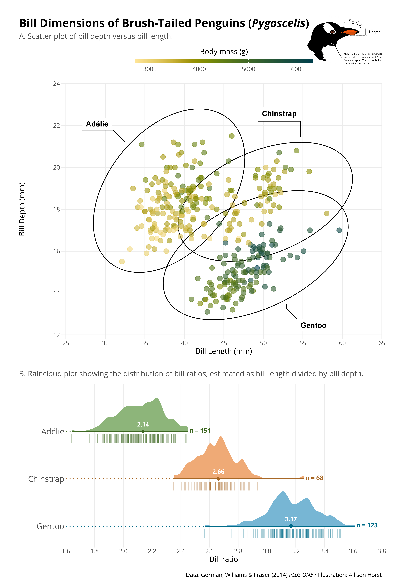
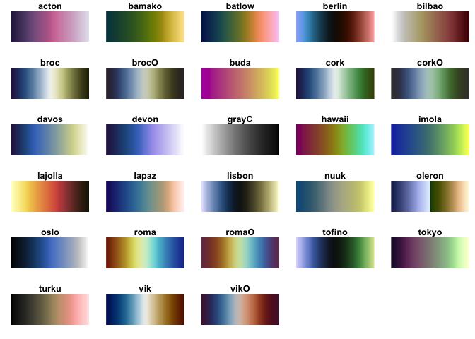

```{r setup, include=FALSE}
knitr::opts_chunk$set(echo = TRUE)
```

I have been saving R-related snippets in Evernote. What I will do here is pick out some of
the ones that I use most often to try to organize them in a more curated fashion.

### Mapping

#### Leaflet

[scale on leaflet map](http://leafletjs.com/reference.html#control-scale)    
http://www.r-bloggers.com/interactive-mapping-with-leaflet-in-r/    
leaflet map sample: http://leaflet-extras.github.io/leaflet-providers/preview/    

### Tables

[How to Make Beautiful Tables](https://rfortherestofus.com/2019/11/how-to-make-beautiful-tables-in-r/)    

### Census

[dot densisty maps](https://tarakc02.github.io/dot-density/)

### Network Analysis & Twitter

[Introduction to Network Analysis with R](https://www.jessesadler.com/post/network-analysis-with-r/)    
[good tutorial to networks](http://psych-networks.com/misinterpreting-networks-an-abbreviated-tutorial-on-visualizations/) and https://www.frontiersin.org/articles/10.3389/fpsyg.2018.01742/full)    
[network of faculty hiring](http://advances.sciencemag.org/content/1/1/e1400005)

### Github Techniques

[GitHub merge](http://allendowney.github.io/amgit/conflict)    
[pull request helpers](https://usethis.r-lib.org/articles/articles/pr-functions.html)    

### ggplot2

[ggridges](https://cran.r-project.org/web/packages/ggridges/vignettes/gallery.html)   

[geofacet](https://hafen.github.io/geofacet/)     

really great collection of tips and tricks: https://github.com/z3tt/outlierconf2021
   tutorial: https://z3tt.github.io/OutlierConf2021/
   
   
scio palettes: https://github.com/thomasp85/scico 


#### sankey plots

Sankey plots.  https://cran.r-project.org/web/packages/ggalluvial/vignettes/ggalluvial.html    
in plotly: https://plot.ly/r/sankey-diagram/    
and see https://matthewdharris.com/2017/11/11/a-brief-diversion-into-static-alluvial-sankey-diagrams-in-r/    
And https://david.frigge.nz/posts/2019-10-rugby-world-cup/    

### Markdown, HTML, and Hugo Shortcodes

[link to Hugo shortcodes](https://gohugo.io/content-management/shortcodes/#use-hugos-built-in-shortcodes)

To insert a figure:

```html
<figure> 
  
  <figcaption>Isn't this better than camping?</figcaption>
</figure> 
```

```
 img style="float: right;" src="/img/taxi.png"> 
<figure.right  > 
  
  <figcaption>Isn't this better than camping?</figcaption>
</figure>
```


Figure which contains a link in the caption:

```
<figure> 
  
  <figcaption>Elevation along the <a href="https://www.ldwa.org.uk/ldp/members/show_path.php?menu_type=S&path_name=West+Highland+Way">West Highland Way (Long Distance Walkers Association)</a> </figcaption>
</figure> 
```

#### A relative reference

Although it's likely this is not a correct reference.

```
#### [Back to UK Walking Topics]()

- [Choosing a path]()

If your writing documentation for Hugo shortcodes, you will need to 
escape the shortcode processing. e.g., 
 will be rendered as .
```

[Hugo figure shortcode](https://gohugo.io/content-management/shortcodes/#figure)

```
and {}
 img style="float: right;" src="/img/taxi.png"> 
<figure.right  > 
  
  <figcaption>Isn't this better than camping?</figcaption>
   
</figure>

markdown code for figure: (html parameters within curly braces)
{width=100%}

{}

Have to use shortcode function to embed shortcode from RMarkdown:
blogdown::shortcode("figure", src = "/img/taxi.png#floatright", caption = "Called using shortcode function")
```

`r blogdown::shortcode("figure", src = "/img/taxi.png#floatright", caption = "Called using shortcode function")`

[workflow for blogdown and netlify](https://www.garrickadenbuie.com/blog/blogdown-netlify-new-post-workflow/)    
[a spoonful of hugo](https://alison.rbind.io/post/2020-12-12-how-much-hugo/)    

#### Markdown for footnote that contains a link

[^1] -- put this where the footnote appears    
[^1]: The footnote is contained in this line of text and can include more markdown formatting.    

